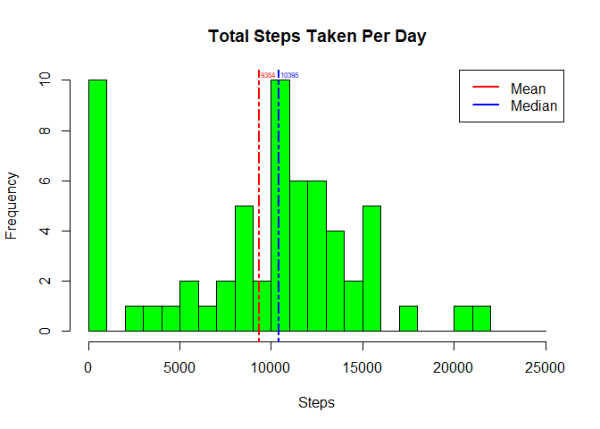
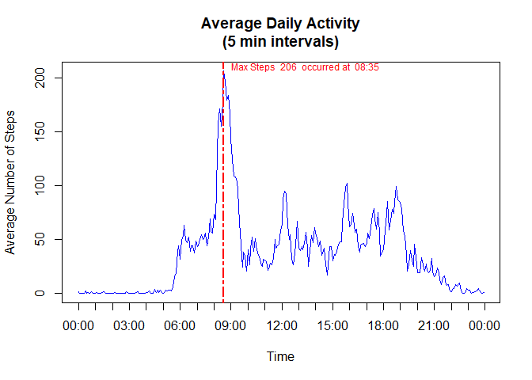
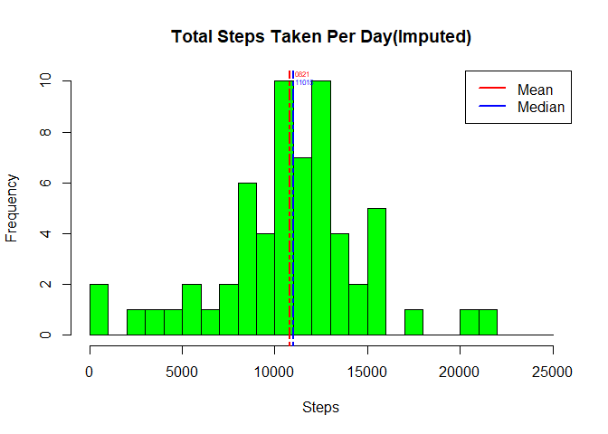
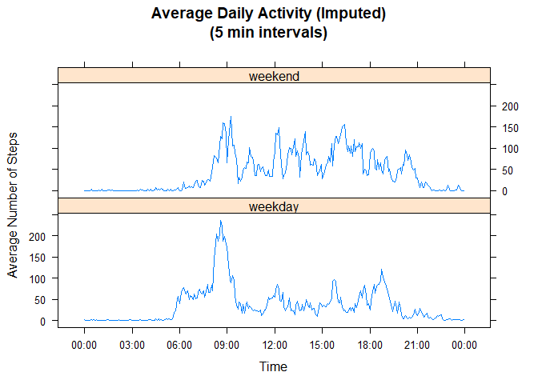

## Environment


```r
plat <- sessionInfo()["platform"]
osv <- sessionInfo()["running"]
rv <- R.version$version.string
library(knitr)
knitrv <- packageVersion("knitr")
library(dplyr, quietly=TRUE, warn.conflicts=FALSE)
dplyrv <- packageVersion("dplyr")
library(lattice)
latticev <- packageVersion("lattice")
```

Platform x86_64-w64-mingw32/x64 (64-bit)

Operating System Windows 10 x64 (build 17134)

R version 3.6.0 (2019-04-26)

knitr version 1.23

dplyr version 0.8.1

lattice version 0.20.38


## Loading and preprocessing the data

The [activity.zip](https://github.com/DarrelSchwarz/RepData_PeerAssessment1/commit/9abcd99566ad027022e4aafbffb5768f9ee11182#diff-d732846a7761c0c1ec91a3ba65791c60) file was downloaded from github on "2019-07-15 15:37:29 AEST".

The file was originally committed on Feb 12, 2014 by user **rdpeng** commit id **9abcd99566ad027022e4aafbffb5768f9ee11182**

Note: Ensure you have the activity.zip file in your working directory.


```r
act <- read.csv(unzip("./activity.zip","activity.csv"), header=TRUE, sep=",")
str(act)
```

```
## 'data.frame':	17568 obs. of  3 variables:
##  $ steps   : int  NA NA NA NA NA NA NA NA NA NA ...
##  $ date    : Factor w/ 61 levels "2012-10-01","2012-10-02",..: 1 1 1 1 1 1 1 1 1 1 ...
##  $ interval: int  0 5 10 15 20 25 30 35 40 45 ...
```

The date column has a type of Factor so convert to date for easier processing.

```r
act$date <- as.Date(act$date,"%Y-%m-%d")
str(act)
```

```
## 'data.frame':	17568 obs. of  3 variables:
##  $ steps   : int  NA NA NA NA NA NA NA NA NA NA ...
##  $ date    : Date, format: "2012-10-01" "2012-10-01" ...
##  $ interval: int  0 5 10 15 20 25 30 35 40 45 ...
```


## What is mean total number of steps taken per day?


```r
daytots <- aggregate(act["steps"], by=act["date"], sum, na.rm=TRUE)
daymean <- mean(daytots$step, na.rm=TRUE)
daymedian <- median(daytots$step, na.rm=TRUE)
daydiff <- daymedian - daymean
```

The Mean of the total number of steps taken per day is 9354.2295082.

The Median of the total number of steps taken per day is 10395.

The difference between the Median and Mean is 1040.7704918 steps.


```r
hist(daytots$steps, main="Total Steps Taken Per Day", 
     xlab="Steps", col="green", breaks=seq(0, 25000, by=1000))
abline(v=daymean, lty=6, col="red", lwd=2)
text(daymean, 10, formatC(daymean, digits=0, format="f"), col="red", cex=0.5, adj=c(-.1, -.5))
abline(v=daymedian, lty=6, col='blue',lwd=2)
text(daymedian, 10, formatC(daymedian, digits=0, format="f"), col="blue", cex=0.5, adj=c(-.1, -.5))
legend("topright", legend=c("Mean", "Median"), col=c("red", "blue"), lwd=c(2,2))
```

<!-- -->


## What is the average daily activity pattern?


```r
act[12:14,]
```

```
##    steps       date interval
## 12    NA 2012-10-01       55
## 13    NA 2012-10-01      100
## 14    NA 2012-10-01      105
```

The interval is in 5 min steps and is stored as an integer as hhmm so need to convert to time so that plots don't have gaps on the interval axis (ie. gaps between 55 and 100 for each hour).


```r
int <- aggregate(act['steps'],by=act['interval'],mean, na.rm=TRUE )
int$time <- formatC(int$interval, width=4, digits = 0, format = "d", flag=0)
int$time <- strptime(int$time,format='%H%M')
maxSteps <- max(int$steps) 
maxStepsInt <- int$interval[which(int$steps==maxSteps)]
maxStepsTm <- strftime(int$time[which(int$steps==maxSteps)],format='%H:%M')
int[12:14,]
```

```
##    interval     steps                time
## 12       55 0.1320755 2019-07-17 00:55:00
## 13      100 0.3207547 2019-07-17 01:00:00
## 14      105 0.6792453 2019-07-17 01:05:00
```

```r
plot(int$time, int$steps, type="l", col="blue",
     main="Average Daily Activity\n(5 min intervals)",
     xaxt = 'n', xlab="Time",
     ylab="Average Number of Steps")
r <- as.POSIXct(round(range(int$time), "hours"))
axis.POSIXct(1, at=seq(r[1], r[2], by="hour"), format="%H:%M")
abline(v=as.numeric(int$time[which(int$steps==maxSteps)]), lty=6, col='red',lwd=2)
text(as.numeric(int$time[which(int$steps==maxSteps)]), maxSteps,
     paste("Max Steps ",formatC(maxSteps, digits=0, format="f"), " occurred at ",maxStepsTm),
     col="red", cex=0.75, adj=c(-0.05, -0.1))
```

<!-- -->

The 5-minute interval with the maximum average steps of 206.1698113 is 08:35 (interval 835 )


## Imputing missing values


```r
sumna <- sum(is.na(act$steps))
sumnaperc <- sum(sumna/length(is.na(act$steps)))*100
```
There are 2304 NA's which is 13.1147541% of the data.

As each weekday appears to have a different interval/step pattern, the missing (NA) step values were replaced with the average steps for that weekday/interval.


```r
act$daytype <- factor(weekdays(act$date)) 
weekDayIntervalMean <- aggregate(act['steps'],by=c(act["interval"],act["daytype"]),mean, na.rm=TRUE)
act2 <- left_join(act, weekDayIntervalMean, by = c("daytype", "interval")) %>% 
    mutate(steps = ifelse(is.na(steps.x), steps.y, steps.x)) %>% 
    select("date","interval", "daytype", "steps")
```


```r
daytots2 <- aggregate(act2['steps'],by=act['date'],sum)
daymean2 <- mean(daytots2$step, na.rm=TRUE)
daymedian2 <- median(daytots2$step, na.rm=TRUE)
daydiff2 <- daymedian2 - daymean2
```

The Mean of the total number of steps taken per day is 1.082121\times 10^{4} (previously 9354.2295082).

The Median of the total number of steps taken per day is 1.1015\times 10^{4} (previously 10395).

The difference between the Median and Mean is now 193.7903981 steps (previously 1040.7704918).


```r
hist(daytots2$steps, main='Total Steps Taken Per Day(Imputed)', 
     xlab='Steps', col='green', breaks=seq(0,25000,by=1000))
abline(v=daymean2, lty=6, col="red", lwd=2)
text(daymean2, 10, formatC(daymean2, digits=0, format="f"), col="red", cex=0.5, adj=c(-.1, -.75))
abline(v=daymedian2, lty=6, col='blue',lwd=2)
text(daymedian2, 10, formatC(daymedian2, digits=0, format="f"), col="blue", cex=0.5, adj=c(-.1, 0.5))
legend("topright", legend=c("Mean", "Median"), col=c("red", "blue"), lwd=c(2,2))
```

<!-- -->

By imputing the missing data, the number of days with zero count has dropped and the histogram looks more like a bell curve.

This has also resulted in the difference between the mean and median narrowing.


## Are there differences in activity patterns between weekdays and weekends?

Add a two level Factor "weekday" & "weekend". Then aggregate by Factor.


```r
act2$daytype <- factor(weekdays(act2$date) %in% c("Saturday","Sunday"), 
                       levels=c(FALSE,TRUE) ,labels=c("weekday","weekend"))
int <- aggregate(act2['steps'],by=c(act2["interval"],act2["daytype"]),mean, na.rm=TRUE )
```

The interval is in 5 min steps so convert to time again before plotting.


```r
int$time <- formatC(int$interval, width=4, digits = 0, format = "d", flag=0)
int$time <- strptime(int$time,format='%H%M')
r <- as.POSIXct(round(range(int$time), "hours"))
xyplot(int$steps~as.POSIXct(int$time)  | int$daytype, type="l",layout=c(1,2),
       main="Average Daily Activity (Imputed)\n(5 min intervals)",
       xlab="Time",
       ylab="Average Number of Steps",
       scales=list(x=list(at=seq(as.POSIXct(r[1]), by="3 hour", length=9),
                          labels=format(seq(as.POSIXct(r[1]), by="3 hour",
                                            length=9), "%H:%M"))))
```

<!-- -->


